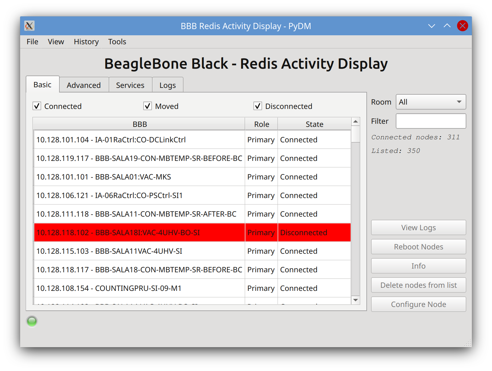

# BBBread

BeagleBone Black - Redis Activity Display, a new way to monitor Control System's most important nodes

## BBB

Requirements:

* Redis database running on port 6379
* bbb-function

Installation:

After installing [bbb-function](https://github.com/lnls-sirius/bbb-function) clone this repository in the `/root`  directory and use the following command to install:

```bash
make install
```

Or the following to uninstall:
```bash
make uninstall
```

### Manual Installation

* Install [bbb-function](https://github.com/lnls-sirius/bbb-function)
* Clone this repository in BBB's /root directory

```bash
cd /root && git clone https://github.com/lnls-sirius/bbbread
cd bbbread
```

* Install dependencies
```bash
pip3 install -r requirements.txt
```

* Configure and start systemd service
```
cp bbbread.service /etc/systemd/system
systemctl daemon-reload
systemctl start bbbread
systemctl enable bbbread
```

## The files

* server: monitors Redis database for disconnected nodes.
* client: runs on BBBs, pings server's Redis database.

For more information, visit the [Sharepoint Document](https://cnpemcamp.sharepoint.com/sites/iot/SitePages/BBBread.aspx) (requires authentication)

## [UI (Web)](https://github.com/cnpem-iot/bbbread-frontend)


## [UI (PyDM)](https://github.com/lnls-sirius/pydm-opi/tree/master/src/siriushlacon/beaglebones)

 