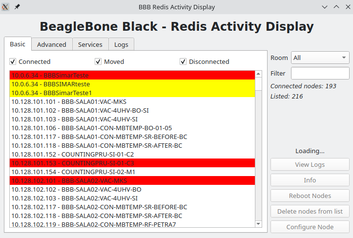
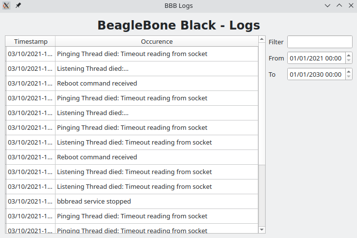
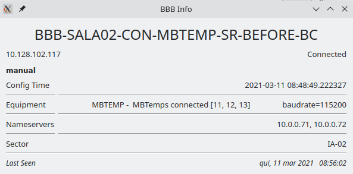

# BBBread

BeagleBone Black - Redis Activity Display, a new way to monitor Control System's most important nodes

## BBB

Requirements:

* Redis database running on port 6379

* bbb python module (comes with bbb-function)

Installation:

After installing [bbb-function](https://github.com/lnls-sirius/bbb-function) clone this repository in /root directory and use the following command to install:

```bash
make install
```

Or the following to uninstall:
```bash
make uninstall
```


### Manual Installation

* Install [bbb-function](https://github.com/lnls-sirius/bbb-function)

* Clone this repository in BBB's /root directory

```bash
cd /root
git clone https://github.com/lnls-sirius/bbbread
```

* Install pyredis

```bash
pip3 install redis
```

* Configure and start systemd service
```
cd bbbread
cp bbbread.service /etc/systemd/system
systemctl daemon-reload
systemctl start bbbread
systemctl enable bbbread
```

## The files

- BBBread.py: project's python module.

- BBBread_Server: monitors redis database for disconnected nodes.

- BBBread_Client: running on BBB, pings redis server's database.

- gui.py: graphical user interface using pyQt.


For more information read the [wiki-sirius page](https://wiki-sirius.lnls.br/mediawiki/index.php/CON:BBBread).

## UI




